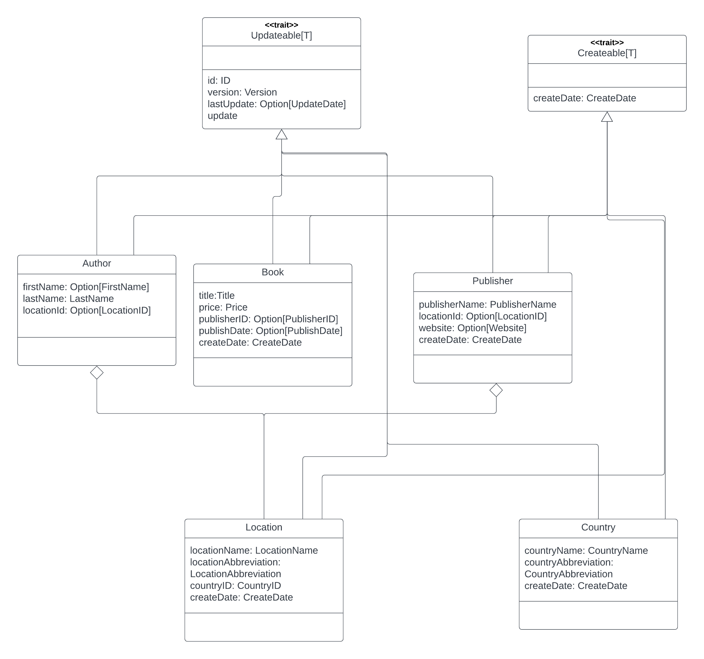

# Book Domain

## Purpose
This project is a proof of concept work investigating different relational database technologies.

It is based on a very simplified book model.

The project:
- exposes a domain  consisting of data types, actions and possible exceptions.  
- setup of relational database that models the domain also provides an implementation of this api using slick.   Eventually the api could be refactored into a separate library and a slick implementation.  This would allow for different implementations in the future.

## Goals
 - investigate how different jdbc librairies work
 - investigate possible code organization patterns
 - investigate test approaches
 - learn more about integration with Postgres

## Database
This project uses a database hosted on a postgres server.  

Instructions on how to set up a local docker instance of postgres are found [here](localPostgres.md)

The database is called book_biz and represents a fictitious publishing company.  

### Environment
The following environment variables are required:
- *BZ_USER* -- the username for access to the book_biz database
- *BZ_PASSWORD* -- the password for access to the book_biz database
- *BZ_SCHEMA* -- the schema in the book_biz database

this schema is typically:
- *local* for individual testing
- *dev* for the shared development environment
- *qa* for separate qa testing
- *prod* for production deployments

## Code structure
The code structure is detailed [here](structure.md)

## Performance tests
Limited Performance testing is described [here](performance.md)